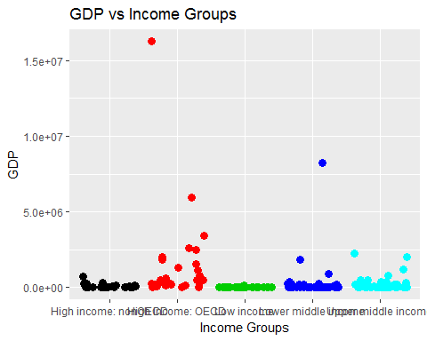

# Global GDP Analysis
Aaron Faltesek  
March 16, 2017  


### Order of Contents

######Introduction | 

######Folder Description | 

######Directions to run the code | 

######References  | 

#####Batch file for gather GDP data and performing analysis.


##Introduction

The folling will detail how to obtain the raw GDP and Education data sets. 

The data is from the websites https://d396qusza40orc.cloudfront.net/getdata%2Fdata%2FGDP.csv and 
https://d396qusza40orc.cloudfront.net/getdata%2Fdata%2FEDSTATS_Country.csv

The first file is GDP data. This has 4 useful columns and several "blank" columns that iwll have to cleaned up.
The useful columns are Country Code (1), GDP Ranking (2), Full Country Name (3) and GDP Amount (4)

The second file is Education data. This data includes elaborated information about globla country data. There are over 20 columns in this data set.
The most important columns that will be used for this analysis is Long Name, Income Group, and Country Code.

Both sets of data have country code as well as superfulous records on global regions. In this analysis the two data sets will be joined/merged on the shares country code values.
Then they will have to be scrubbed to rid of unneeded regional information.

Common scrubbing necessary:
1) Remove null values
2) Remove commas from integer values for conversion and comparison
3) Remove unneeded records - Regional data
4) Remove messy headers


##Folder Structure
The folder Global_GDP_Analysis/ will contain all necessary files for this analysis
Markdown file:

-CaseStudyRMarkDownFinal_AaronFaltesek.Rmd

Main file:

Child source files:

-CleanData.R

-Question1.R

-Question2.R

-Question3.R

-Question4.R

-Question5.R

HTML Output:

-CaseStudyRMarkDownFinal_AaronFaltesek.html

#Directions for running the code.

####Libraries required
#####Install if needed below:
######install.packages("downloader")
######install.packages("ggplot2")

```r
require(downloader)
```

```
## Loading required package: downloader
```

```
## Warning: package 'downloader' was built under R version 3.3.3
```

```r
library(downloader)

require(ggplot2)
```

```
## Loading required package: ggplot2
```

```
## Warning: package 'ggplot2' was built under R version 3.3.3
```

```r
library(ggplot2)
```

#####Set my directory where i'll be downloading files

```r
setwd("D:/Users/Aaron/Documents/School/SMU/Intro_To_DataScience/Unit_8/Case_Study/Global_GDP_Analysis")
print(getwd())
```

```
## [1] "D:/Users/Aaron/Documents/School/SMU/Intro_To_DataScience/Unit_8/Case_Study/Global_GDP_Analysis"
```
#####Getting the raw data. This data will have to be cleaned up

```r
download("https://d396qusza40orc.cloudfront.net/getdata%2Fdata%2FGDP.csv",destfile="GDP.csv")
download("https://d396qusza40orc.cloudfront.net/getdata%2Fdata%2FEDSTATS_Country.csv ",destfile="Educ.csv")
```

#####This will call an R script that will clean up the data so that I can merge them together

```r
source("CleanData.R", echo = TRUE, keep.source = TRUE)
```

```
## 
## > #Reading the raw data into an object so that I can clean up the data for analysis. Starting here with GDP
## > #Options
## > #skip=5 | This is done to ski .... [TRUNCATED] 
## 
## > #I just want the 1st(Country Code),2nd(Rank),4th(Full Country Name), and 5th(GDP Amount) columns. The rest are blank
## > GDP_Wip2 <- GDP_Wip[c("V1","V ..." ... [TRUNCATED] 
## 
## > #Remove blank lines from GDP_Wip2 for merge
## > #Removes blank lines between records
## > GDP_Wip3 <- GDP_Wip2[-c(191, 216, 218), ] 
## 
## > #removes trailing blank lines
## > GDP_Wip4 <- GDP_Wip3[1:228,]
## 
## > #Now I need to clean up the education data. It's still in it's raw form. 
## > #Options
## > #blank.lines.skip=TRUE | Using the head command to peak into  .... [TRUNCATED]
```
#####This will contain the R code to answer question 1

```r
source("Question1.R", echo = TRUE, keep.source = TRUE)
```

```
## 
## > #Question 1: Merge the data based on the country shortcode. How many of the IDs match?
## > #Merge the data sets
## > #I need to limit the data in my GDP_ .... [TRUNCATED] 
## 
## > #GDPLength <- nrow(GDP_Wip4)
## > #EducLength <- nrow(Educ_Wip)
## > 
## > #The merge will not carry over any rows that do not mathc, therefore the nrow func .... [TRUNCATED] 
## 
## > cat(paste(toString(MergeLength) ,"rows were successfully joined."))
## 224 rows were successfully joined.
```
#####I output my answer in the source file, but for clarify the answer to question one is that 224 rows were successfully joined.
#####----------------------------------------------------------------------

#####This will contain the R code to answer question 2

```r
source("Question2.R", echo = TRUE, keep.source = TRUE)
```

```
## 
## > #Question 2: Sort the data frame in ascending order by GDP (so United States is last). 
## > #What is the 13th 
## > #country in the resulting data frame? .... [TRUNCATED] 
## 
## > #initial order didn't work on the factorial datatype of V5, however it did place
## > #all non valid country rows at the bottom so I can remove them wi .... [TRUNCATED] 
## 
## > MergeGDPValid <- MergeGDPValid[1:189,]
## 
## > #Convert to integer, had to remove commas to properly convert
## > MergeGDPValid$V5 <- gsub(",", "", MergeGDPValid$V5)
## 
## > MergeGDPValid$V5 <- as.integer(as.character(MergeGDPValid$V5))
## 
## > #order the data frame by the GDP column. Then feed to a new data set
## > sortedMerge <- MergeGDPValid[order(MergeGDPValid$V5,decreasing = FALSE),]
## 
## > #Pull the 13th value from the data frame
## > print(paste(toString(sortedMerge$Long.Name[[13]]),"is the 13th country from the list when ordered by asce ..." ... [TRUNCATED] 
## [1] "St. Kitts and Nevis is the 13th country from the list when ordered by ascending GDP"
```
#####----------------------------------------------------------------------

#####This will contain the R code to answer question 3

```r
source("Question3.R", echo = TRUE, keep.source = TRUE)
```

```
## 
## > #Question 3: What are the average GDP rankings for the "High income: OECD" and "High income:
## > #nonOECD" groups?
## > 
## > #I can use the sorted data fro .... [TRUNCATED] 
## 
## > #Take the average income of this subset 
## > HighIncOECDAvg <- mean(as.integer(as.character(HighIncOECD$V2)))
## 
## > paste(HighIncOECDAvg,"is the mean rank of the High income: OECD countries.")
## [1] "32.9666666666667 is the mean rank of the High income: OECD countries."
## 
## > #Now I want o t answer the second part of the question, pulling a subset of nonOECD countries
## > HighIncNon <- sortedMerge[(sortedMerge$Income.Group= .... [TRUNCATED] 
## 
## > #Take the average income of this subset 
## > HighIncNonAvg <- mean(as.integer(as.character(HighIncNon$V2)))
## 
## > print(paste(HighIncNonAvg,"is the mean of the High income: nonOECD countries."))
## [1] "91.9130434782609 is the mean of the High income: nonOECD countries."
```
#####----------------------------------------------------------------------

#####This will contain the R code to answer question 4

```r
source("Question4.R", echo = TRUE, keep.source = TRUE)
```

```
## 
## > #Question 4: Plot the GDP for all of the countries. Use ggplot2 
## > #to color your plot by Income Group.
## > 
## > #below I use the ggplot to display the  .... [TRUNCATED]
```

<!-- -->
#####----------------------------------------------------------------------

#####This will contain the R code to answer question 5

```r
source("Question5.R", echo = TRUE, keep.source = TRUE)
```

```
## 
## > #Question 5:Cut the GDP ranking into 5 separate quantile groups. Make a table versus Income.Group.
## > #How many countries are Lower middle income but .... [TRUNCATED] 
## 
## > #now that i have the quantiles i want to make a table of quant vs income
## > testTable <- table(sortedMergeQuantTest$quantile,sortedMergeQuantTest$Inc .... [TRUNCATED] 
## 
## > #now I need to determine how many countries are in the top 38 countries by GDP and in the lower middle income group
## > #this would be cell row 5, col .... [TRUNCATED] 
## 
## > print(cleanUpTable)
##    
##     High income: nonOECD High income: OECD Low income Lower middle income
##   1                    2                 0         11                  16
##   2                    4                 1         16                   9
##   3                    8                 1          9                  11
##   4                    5                10          1                  13
##   5                    4                18          0                   5
##    
##     Upper middle income
##   1                   9
##   2                   8
##   3                   8
##   4                   9
##   5                  11
## 
## > print(paste(cleanUpTable[5,4],"countries are in the top 38(top quantile based on GDP) and also in the lower middle income group category"))
## [1] "5 countries are in the top 38(top quantile based on GDP) and also in the lower middle income group category"
```

#Conclusion
A lot can be learned from comparing GDP to income catagorization. After cleaning up the data and merging them on country code. I found that there were some missing corresponding matches. This reduced the total number of successful joins to 224. Then when I ordered the data by ascending on the GDP amount I found that St. Knitts and Nevis was the 13th value in the data set from the top. Next I found the mean rank of High income: OECD countries to be 32.97. I also found the mean rank of High income: nonOECD countries to be 91.91. The results of this question are specific to the initial rank assigned to each country. For the fourth question I found that there were significant outliers in the data that skewed the resulting plot. The US and China stand out as having exceptionally large GDPs.Lastly for question 5, I was able to compare the income groups to quantiles. I then found that of the lower middle income groups, in the top 38 counties(top quantile) there were 5 in both of these groups.

#References

https://www.r-bloggers.com/how-to-format-your-chart-and-axis-titles-in-ggplot2/

http://stackoverflow.com/questions/31149875/r-knitr-and-source-function-how-to-preserve-source-file-comments-for-html-rep

http://stackoverflow.com/questions/10966109/how-to-source-r-markdown-file-like-sourcemyfile-r

http://stackoverflow.com/questions/11728419/using-cut-and-quartile-to-generate-breaks-in-r-function
